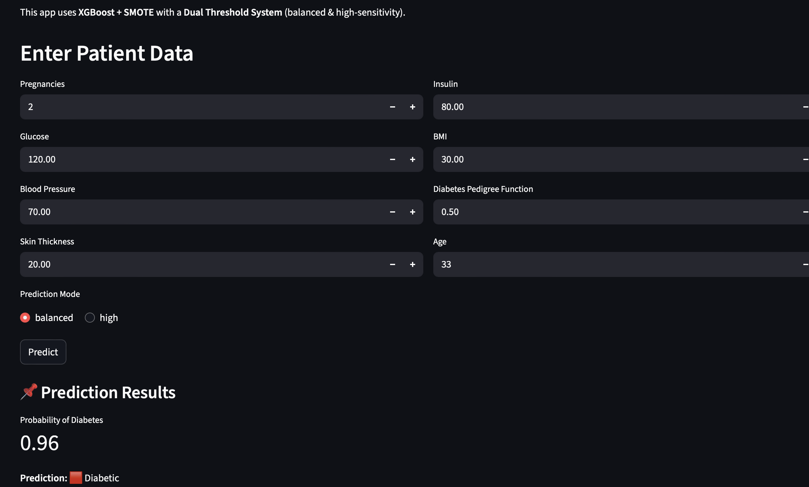
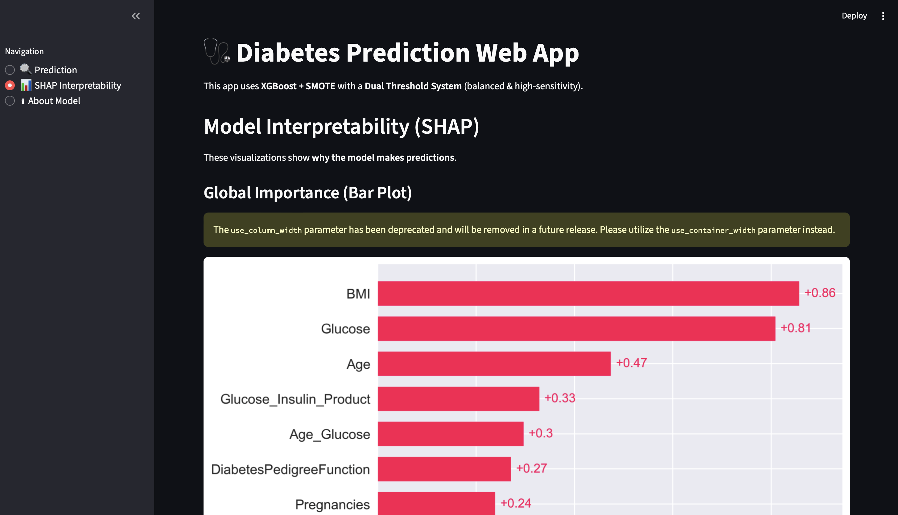
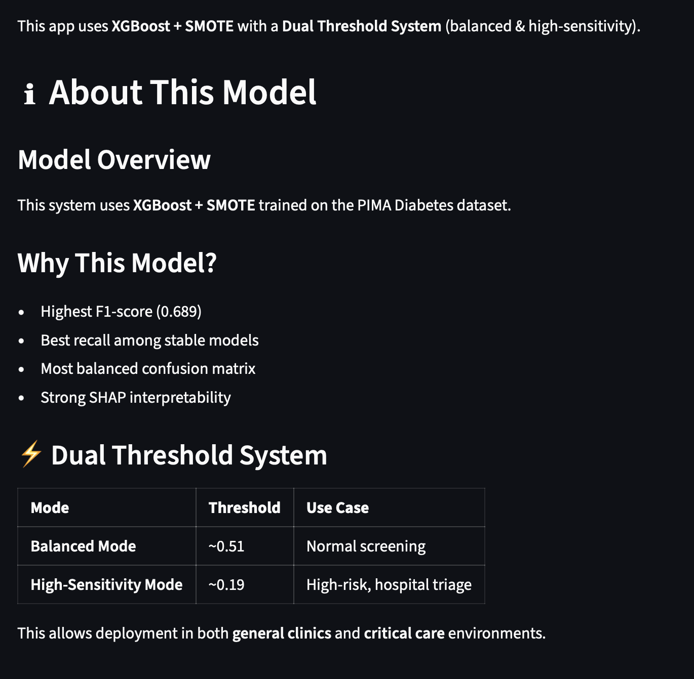
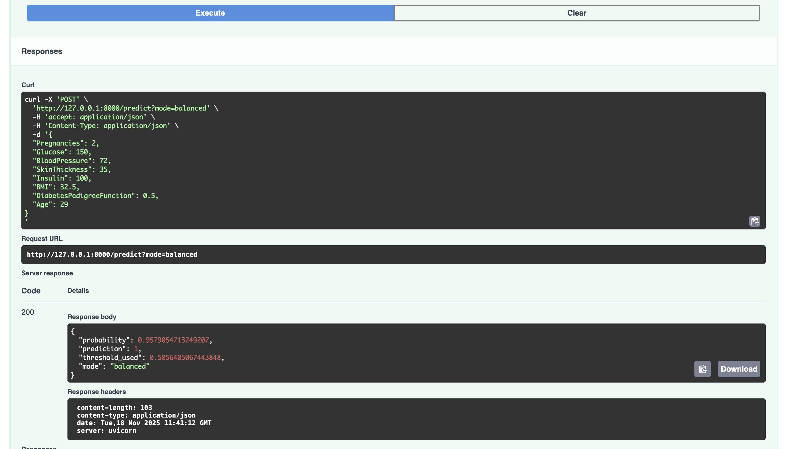

#  Diabetes Prediction Using XGBoost + SMOTE  
*A Complete End-to-End Machine Learning System with Explainability, API, and Streamlit UI*

---

##  Project Overview

Diabetes is one of the most rapidly increasing chronic diseases worldwide. Early prediction enables timely lifestyle changes and clinical interventions.  
Using the classical **PIMA Indians Diabetes Dataset**, this project builds a **clinically meaningful, interpretable, and deployable machine learning system** for diabetes risk prediction.

This is not just a model — it is a **full ML pipeline**, including:

- ✔ Data preprocessing & feature engineering  
- ✔ Imbalanced data handling using **SMOTE**  
- ✔ Model training with **XGBoost** and multiple baselines  
- ✔ Threshold optimization (Balanced & High-Sensitivity modes)  
- ✔ SHAP-based medical interpretability  
- ✔ Error analysis for safety-critical understanding  
- ✔ Deployable **FastAPI backend**  
- ✔ **Streamlit Web Application**  
- ✔ Structured folder architecture for industry use  
- ✔ Production-ready model export (pickle + json)

This work is structured for **research internship applications**, demonstrating both technical rigor and real-world deployment capability.

---

#  Why This Problem Matters

- Diabetes often remains undetected until late stages.  
- Traditional clinical cutoffs (e.g., fasting glucose) miss borderline patients.  
- A machine learning system that uses **all available clinical and lifestyle features** can detect risk earlier.  
- But medical datasets are imbalanced — models risk high false negatives.  
- Hence, this project focuses on:
  - Sensitivity (recall)
  - Interpretability (SHAP)
  - Dual-threshold clinical decision modes

---

#  Key Innovations

###  1. **Imbalanced Learning with SMOTE**
Medical datasets often have fewer positive cases (diabetic patients).  
SMOTE generates synthetic minority samples → improves recall, stability, F1-score.

###  2. **Dual Threshold System**
Real hospitals use different decision modes:

| Mode | Use-case | Goal |
|------|----------|------|
| **Balanced Mode (Threshold ~0.51)** | Normal screening | Balanced precision–recall |
| **High-Sensitivity Mode (Threshold ~0.19)** | High-risk populations | Maximum recall, minimal false negatives |

###  3. **SHAP Clinical Explainability**
Doctors must understand *why* the model predicted diabetes.

SHAP provides:  
✔ Feature importance bars  
✔ Patient-level waterfall plots  
✔ Dependence plots  
✔ Global beeswarm summary

###  4. **Full Deployment Pipeline**
Includes:

- FastAPI backend for inference  
- Streamlit UI with:
  - A fully interactive form  
  - Interpretation graphics  
  - Live probability and confidence  
- Docker & modular structure

---
## Streamlit Web App — Screenshots

### Prediction Page

### SHAP Global Interpretability

### About Model Page

---

## FastAPI — Screenshots

### API Docs (Swagger UI)

### API Prediction Example

---

---
#  Folder Structure

diabities-ml/
│
├── diab_app/
│   │
│   ├── api/
│   │   └── main.py
│   │
│   ├── streamlit/
│   │   └── app.py
│   │
│   ├── models/
│   │   ├── xgb_model.pkl
│   │   ├── scaler.pkl
│   │   ├── feature_names.json
│   │   └── thresholds.json
│   │
│   └── assets/
│       ├── shap_bar.png
│       ├── shap_beeswarm.png
│       ├── shap_waterfall_sample10.png
│       ├── shap_dependence_Glucose.png
│       ├── shap_dependence_Insulin.png
│       ├── shap_dependence_Pregnancies.png
│       ├── shap_dependence_SkinThickness.png
│       └── shap_dependence_BloodPressure.png
│
└── notebooks/
    ├── 1_Data_Preprocessing_and_Feature_Engineering.ipynb
    ├── 2_Modeling_and_Error_Analysis.ipynb
    ├── 3_SHAP_Explainability.ipynb
    └── 4_Final_Model_Training_and_Export.ipynb

---

#  Dataset Summary

This project uses the **PIMA Indians Diabetes Dataset**, containing:

- **768 patients**
- **8 clinical features**
- **Outcome variable:** Diabetes (0 = No, 1 = Yes)

Features include:
- Pregnancies  
- Glucose  
- Blood Pressure  
- Skin Thickness  
- Insulin  
- BMI  
- Diabetes Pedigree Function  
- Age  

---

#  Machine Learning Pipeline

## **1. Data Cleaning**
- Identified medical impossibilities (e.g., glucose = 0)
- Replaced zeros with `NaN` in relevant features
- Added missing-flag indicators for:
  - Glucose
  - BloodPressure
  - SkinThickness
  - Insulin
  - BMI

## **2. Feature Engineering**
Created 17 new medically meaningful features, including:

- `Glucose_Insulin_Product`  
- `BMI_Age_Interaction`  
- `BMI_per_Age`  
- `High_Glucose` flag  
- `HOMA_IR` (Insulin resistance index)  
- Log-transformed features  
- Square-root insulin  
- Age/Glucose interaction  
- Missing-value flags  

Final feature count: **25**

## **3. Train-Test Split**
- 80/20 split
- Standard Scaling
- SMOTE only applied to training set

## **4. Models Trained**
Baseline:
- Logistic Regression (balanced)
- Random Forest (balanced)

With SMOTE:
- Logistic Regression + SMOTE  
- Random Forest + SMOTE  
- SVM (RBF) + SMOTE  
- **XGBoost + SMOTE (Best)**

---

#  Final Model Performance

### **XGBoost + SMOTE (Best Model)**

| Metric | Score |
|--------|--------|
| Accuracy | **0.766** |
| Precision | **0.660** |
| Recall | **0.740** |
| F1-Score | **0.689** |
| ROC–AUC | **0.89** |
| PR–AUC | **0.70** |

---

#  Threshold Optimization

Two clinical operating modes were derived:

### ** Balanced Mode (Threshold ≈ 0.51)**
- Good precision & recall  
- Recommended for general population screening  

### ** High-Sensitivity Mode (Threshold ≈ 0.19)**
- Much higher recall  
- For high-risk patients  
- Designed to minimize false negatives  

---

#  Error Analysis (Safety Critical)

We analyzed failures at both thresholds.

### **False Negatives (FN) Patterns**
- Low glucose but high BMI  
- Missing insulin data  
- Lower skin thickness  
- Younger patients with poor indicators  

### **False Positives (FP) Patterns**
- High insulin  
- High glucose  
- High BMI  
- High interaction features  

We used SHAP to examine **root causes** of errors → ensures clinical reliability.

---

#  SHAP Explainability

### Global Importance
Top features influencing diabetes prediction:
1. Glucose  
2. BMI  
3. Pregnancies  
4. Insulin  
5. BloodPressure  

### Patient-Level Explanation
The waterfall plot shows how each feature pushes the prediction towards diabetic or non-diabetic.

### Dependence Plots (clinical insights)
- Higher Glucose sharply increases risk  
- BMI strongly affects diabetic probability  
- Insulin interacts with Glucose nonlinearly  
- Pregnancies influence risk in older women  

---

#  FastAPI Backend

The predictor is deployed using FastAPI:

POST /predict?mode=balanced
POST /predict?mode=high

Takes JSON input, returns:
- Probability  
- Prediction  
- Threshold used  
- Mode  

---

#  Streamlit Application

Features:
- Clean UI with medical form  
- Balanced/High-sensitivity mode switch  
- Displays prediction probability  
- Shows SHAP plots (global importance)  
- Future-ready structure for:
  - Patient-level SHAP  
  - Login system  
  - Database logging  

Run:

streamlit run app.py

---

# Model Export Details

Saved in `/models`:

- `xgb_model.pkl` → trained model  
- `scaler.pkl` → StandardScaler  
- `feature_names.json` → correct feature ordering  
- `thresholds.json` → operating thresholds  

---

#  Reproducibility

All preprocessing, models, thresholds, and SHAP plots can be regenerated by running:
- 1_Data_Preprocessing_and_Feature_Engineering.ipynb  
- 2_Modelling_and_SMOTE_Training.ipynb  
- 3_Interpretability_and_Error_Analysis.ipynb  
- 4_Final_Model_Export_and_Deployment_Prep.ipynb  

---

#  Tech Stack

- Python 3  
- XGBoost  
- scikit-learn  
- imbalanced-learn (SMOTE)  
- SHAP  
- Matplotlib / Seaborn  
- FastAPI  
- Streamlit  

---

# Future Extensions

- Live patient-level SHAP in Streamlit  
- Authentication system  
- Cloud deployment (Render / AWS / Azure)  
- Mobile-friendly interface  
- Medical report PDF generation  
- Docker containerization  
- CI/CD pipeline  

---

# Acknowledgements

- PIMA Indians Diabetes Dataset  
- XGBoost authors  
- SHAP explainability framework  
- FastAPI & Streamlit communities  

---

#  Contact

**Apoorv**  
Machine Learning & Data Science Enthusiast  
GitHub: https://github.com/iamApoorv-03  
Email: apoorvprashar2006@gmail.com

---
